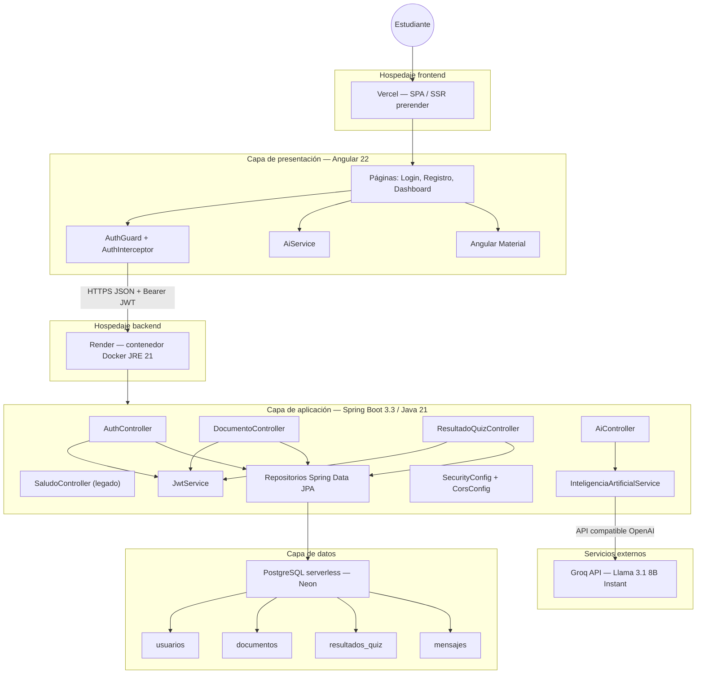
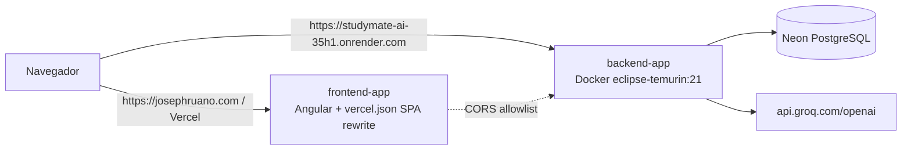
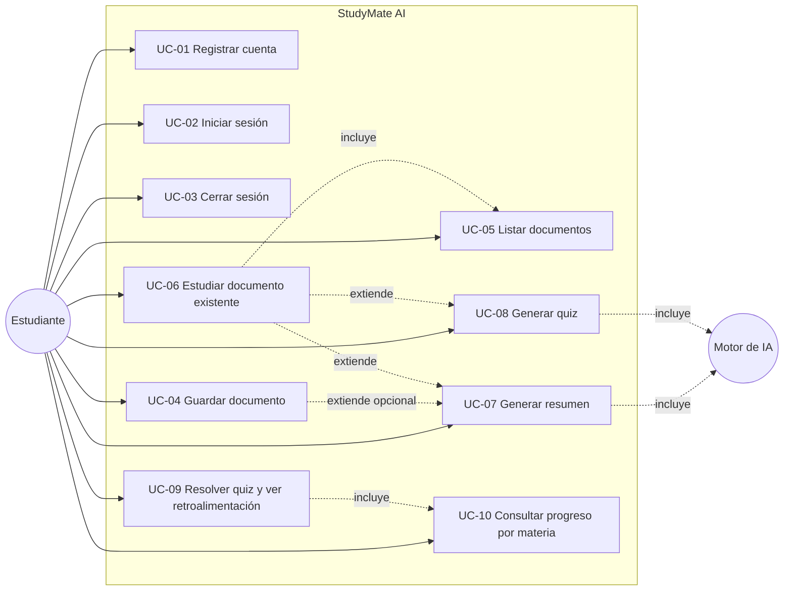
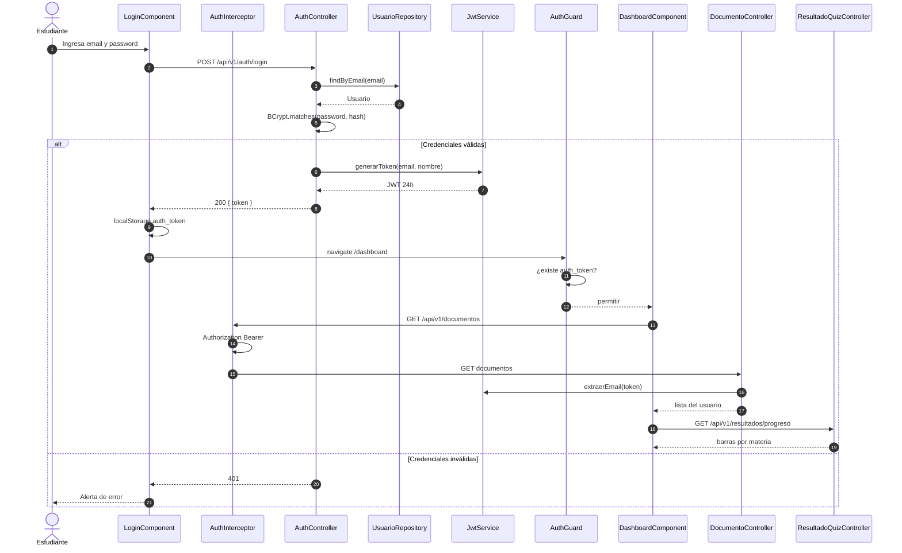
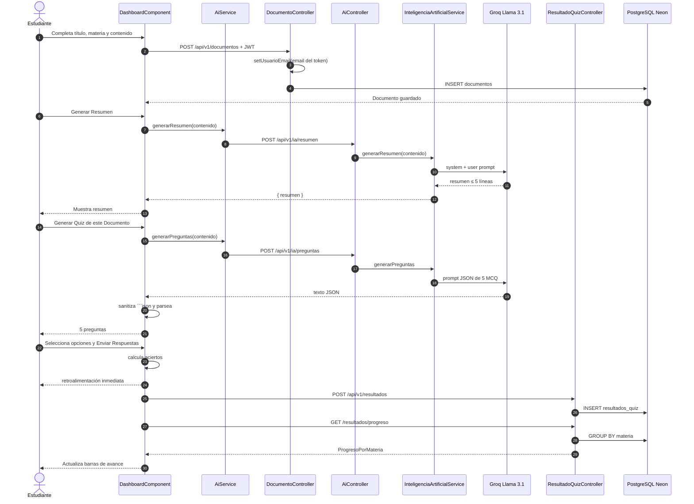
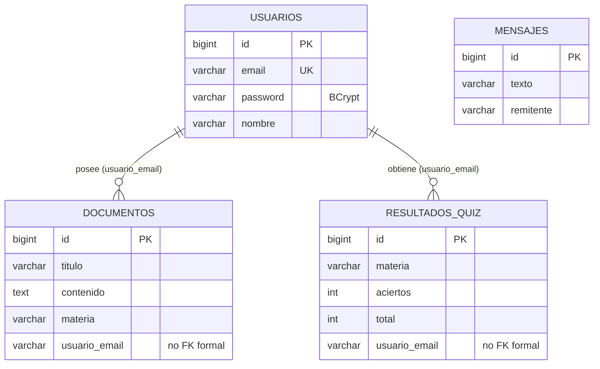

# Análisis de ingeniería de software — StudyMate AI

**Proyecto:** StudyMate AI  
**Repositorio:** `jruanoga/maestria-proyecto-web`  
**Autor del sistema:** Joseph Emiliano Ruano Gálvez  
**Materia:** Desarrollo de Aplicaciones para Internet — Maestría en Sistemas  
**Fuente de este documento:** inspección del código, configuración, despliegue e historial Git (no existe un SRS formal previo).

---

## 0. Requisitos funcionales y no funcionales clave

Los requisitos se reconstruyen a partir del README, de las pantallas Angular (`login`, `registro`, `dashboard`) y de los endpoints REST del backend Spring Boot.

### Cómo leer esta sección

Un **requisito** no es “una pantalla” ni “una clase Java”. Es una **obligación del sistema** frente a un usuario o al entorno.

- **Funcional (RF):** *qué hace* el producto. Se puede demostrar con un flujo: “el estudiante sube un apunte y obtiene un resumen”. Si lo quitas, falta una capacidad.
- **No funcional (RNF):** *cómo debe comportarse* mientras hace esas cosas: seguro, usable, desplegable, mantenible. Si lo quitas, la función “sigue existiendo”, pero mal (contraseñas en claro, UI congelada, no se puede publicar).

El hilo de negocio del README es uno solo: **reducir tiempo de estudio y reforzar aprendizaje activo**. Todos los RF de abajo son piezas de esa cadena:

```text
Crear cuenta → entrar → guardar apuntes → (re)abrirlos → resumir con IA
    → autoevaluarse con quiz → guardar nota → ver progreso por materia
```

Sin RF-01/02 no hay usuario. Sin RF-04/06 no hay material. Sin RF-07/08/09 no hay “asistente”. Sin RF-10/11 no hay memoria de aprendizaje. RF-03 y RF-13 no son “features de lujo”: son la condición para que lo anterior no se mezcle entre estudiantes.

### 0.1 Requisitos funcionales (RF)

| ID | Requisito | Evidencia en el código |
| --- | --- | --- |
| **RF-01** | El visitante puede **registrarse** con nombre, correo y contraseña. El correo no puede repetirse. | `POST /api/v1/auth/registro`, `RegistroComponent` |
| **RF-02** | El usuario puede **iniciar sesión** con correo y contraseña. Recibe un token JWT si las credenciales coinciden. | `POST /api/v1/auth/login`, `LoginComponent` |
| **RF-03** | El sistema **protege el dashboard**: sin token no se accede a `/dashboard`. | `authGuard` + ruta `canActivate` |
| **RF-04** | El usuario autenticado puede **guardar un documento** de estudio (título, materia y contenido de texto). Si no indica materia, se usa `General`. | `POST /api/v1/documentos`, `guardarDocumento()` |
| **RF-05** | El usuario puede **listar solo sus documentos**. | `GET /api/v1/documentos` filtrado por email del JWT |
| **RF-06** | El usuario puede **estudiar un documento existente**: al seleccionarlo se carga su contenido y materia en el área de IA/quiz. | `seleccionarDocumento()` |
| **RF-07** | El usuario puede **generar un resumen** del contenido académico mediante IA (máximo 5 líneas, tono de asistente de estudio). | `POST /api/v1/ia/resumen`, `InteligenciaArtificialService.generarResumen` |
| **RF-08** | El usuario puede **generar un quiz** de exactamente 5 preguntas de opción múltiple (A–D) con respuesta correcta, en JSON. | `POST /api/v1/ia/preguntas`, `generarQuiz()` |
| **RF-09** | El usuario puede **responder el quiz**, ver aciertos/errores de inmediato y un puntaje `X de N`. | `enviarQuiz()`, retroalimentación en `dashboard.html` |
| **RF-10** | El sistema **persiste el resultado** del quiz (materia, aciertos, total) asociado al usuario. | `POST /api/v1/resultados` |
| **RF-11** | El usuario puede **consultar su progreso por materia** (suma de aciertos / total, barra de porcentaje con umbrales 40% y 70%). | `GET /api/v1/resultados/progreso`, proyección `ProgresoPorMateria` |
| **RF-12** | El usuario puede **cerrar sesión** y volver al login. | `cerrarSesion()` (navega a `/login`; no borra el token) |
| **RF-13** | El sistema aísla datos **multiusuario**: documentos y resultados se ligan al email extraído del JWT, no al cuerpo de la petición. | `DocumentoController`, `ResultadoQuizController` |

**Alcance residual (no es un caso de uso de producto, pero existe en API):**

- `GET/POST /api/v1/mensajes` y la entidad `mensajes` quedan de un sprint temprano de práctica HTTP/JPA. No hay UI que los consuma.
- `GET /api/v1/ia/consulta` permite una pregunta libre a la IA. El dashboard no lo usa.

### 0.2 Requisitos no funcionales (RNF)

| ID | Categoría | Requisito | Cómo se cubre hoy |
| --- | --- | --- | --- |
| **RNF-01** | Arquitectura | Cliente y servidor desacoplados, API REST versionada (`/api/v1`). | Angular SPA + Spring Boot |
| **RNF-02** | Seguridad | Contraseñas nunca en texto plano. | `BCryptPasswordEncoder` |
| **RNF-03** | Seguridad | Autenticación sin estado, token firmado, expiración 24 h. | JWT HS256, `jwt.secret` por entorno |
| **RNF-04** | Seguridad | Secretos fuera del código (BD, JWT, Groq). | `.env` / variables de entorno; `.env` en `.gitignore` |
| **RNF-05** | Seguridad / red | El frontend de producción puede llamar al API (CORS). | Orígenes: localhost, Vercel y dominio propio |
| **RNF-06** | Disponibilidad / despliegue | Frontend y backend desplegables en la nube de forma independiente. | Vercel + Render (Docker) + Neon |
| **RNF-07** | Portabilidad | El backend se construye de forma reproducible. | `Dockerfile` multi-stage, Maven Wrapper, Java 21 |
| **RNF-08** | Usabilidad | UI de componentes Material, estados de carga, errores visibles en resumen/quiz/registro. | Angular Material, spinners, mensajes en rojo |
| **RNF-09** | Rendimiento percibido | Respuestas de IA asíncronas; la UI no se bloquea. | `HttpClient` + RxJS `subscribe`, spinners |
| **RNF-10** | Integridad de datos | Correo de usuario único. Contenido de documento como `TEXT`. | `@Column(unique = true)`, `columnDefinition = "TEXT"` |
| **RNF-11** | Compatibilidad de IA | Uso de un LLM económico y compatible con API OpenAI. | Groq + `llama-3.1-8b-instant` vía Spring AI |
| **RNF-12** | Mantenibilidad | Configuración de URL de API por ambiente (dev vs prod). | `environment.ts` / `environment.prod.ts` |
| **RNF-13** | Calidad de build | Control de tamaño de bundle en producción. | Budgets Angular (`500kB` warning / `1MB` error) |
| **RNF-14** | Consistencia de código (frontend) | Formato uniforme. | Prettier + EditorConfig |
| **RNF-15** | Escalabilidad de datos | Base de datos PostgreSQL serverless, no embebida. | Neon |

**Brechas relevantes (no cubiertas o cubiertas a medias):**

- Spring Security deja `anyRequest().permitAll()`: el JWT se usa en controladores, pero **no hay filtro JWT** a nivel de cadena de seguridad.
- CSRF deshabilitado (aceptable en API stateless, pero no hay autorización real en el filtro).
- `cerrarSesion()` no elimina `auth_token` de `localStorage`.
- No hay CI (GitHub Actions), ni pruebas e2e, ni validación de esquema OpenAPI.
- `hibernate.ddl-auto=update` no es una estrategia de migraciones de producción.

### 0.3 Explicación detallada de cada requisito funcional

Piénsalos como **historias de usuario** con criterio de aceptación. El “si falla” es tan importante como el flujo feliz: ahí se ve si el requisito está realmente cubierto.

#### Identidad y acceso (RF-01 a RF-03 y RF-12)

**RF-01 — Registrarse.**  
El sistema no nace con usuarios precargados. Un visitante en `/registro` da nombre, correo y contraseña. El backend comprueba que ese correo no exista (`409`) y guarda el password **hasheado**. Criterio de aceptación: dos personas no pueden compartir el mismo email; después del alta se va a login (aún no hay sesión). Si el correo ya existe, el UI dice “Ese correo ya está registrado.”

**RF-02 — Iniciar sesión.**  
No es “entrar a una pantalla”: es **demostrar identidad**. El backend busca el email, compara el password con BCrypt y, si coincide, emite un JWT (subject = email, claim `nombre`, 24 h). El frontend guarda `auth_token` en `localStorage` y navega al dashboard. Si falla: HTTP 401 y alerta. Sin este RF, RF-04…RF-11 no tienen dueño.

**RF-03 — Proteger el dashboard.**  
`/dashboard` es zona privada. El `AuthGuard` mira si hay token en el navegador; si no, redirige a `/login`. Ojo: es protección **de ruta en el cliente**. El servidor, hoy, no exige JWT en un filtro de Spring Security (`permitAll`). RF-03 cubre “un extraño no ve la UI”; no cubre por sí solo “un extraño no puede pegarle al API”.

**RF-12 — Cerrar sesión.**  
Intención: volver a visitante. Implementación actual: solo `navigate(['/login'])`. El token **sigue en `localStorage`**, así que si el usuario escribe `/dashboard` a mano, el guard lo deja pasar. El requisito de producto existe; el criterio de aceptación “la sesión queda inválida en este browser” **no se cumple del todo**.

#### Material de estudio (RF-04 a RF-06)

**RF-04 — Guardar documento.**  
El “subir documento” del README **no es un archivo PDF**: es pegar título, materia y texto. Materia vacía → `General`. Sin título o contenido, el botón no hace nada. El servidor ignora cualquier `usuarioEmail` del JSON y pone el email del JWT. Ejemplo: apunte “Capas OSI” / materia “Redes” / párrafo de clase.

**RF-05 — Listar solo los míos.**  
Al abrir el dashboard se pide `GET /documentos`. La tabla “Mis Documentos” no es un `findAll()` global: `findByUsuarioEmail`. Si Ana y Bruno usan la misma app, Ana no debe ver los apuntes de Bruno. Esto es el requisito de **confidencialidad de datos de estudio**, no solo “mostrar una tabla”.

**RF-06 — Estudiar un documento ya guardado.**  
“Estudiar” no llama a la IA todavía. Copia `contenido` y `materia` al área de trabajo y **limpia** resumen/quiz anteriores, para no mezclar un examen de Redes con apuntes de Base de Datos. RF-06 es el puente entre la biblioteca (RF-05) y las funciones de IA (RF-07/08).

#### Asistente de IA y autoevaluación (RF-07 a RF-11)

**RF-07 — Generar resumen.**  
Problema de negocio: el estudiante tarda en sintetizar. El sistema manda el texto a Groq con un *system prompt* de “asistente experto en estudio”, máximo 5 líneas, sin opiniones. El resumen es **efímero**: si recargas, se pierde (no hay columna `resumen`). Si Groq falla, se muestra un error y se puede reintentar; la app no se cae. Criterio: dado un apunte no vacío, aparece un párrafo corto o un mensaje de fallo explícito.

**RF-08 — Generar quiz.**  
Aprendizaje activo = evaluarse, no solo leer. El prompt pide **exactamente 5** preguntas, 4 opciones y `respuestaCorrecta`, en JSON puro. El frontend es desconfiado: recorta ```json y parsea. Si el LLM inventa prosa, RF-08 se considera fallido de forma controlada (“inténtalo de nuevo”), no con una pantalla rota. El quiz también es efímero hasta que se envía (RF-10).

**RF-09 — Resolver y ver retroalimentación inmediata.**  
Aquí vive el valor pedagógico. El estudiante marca radios, envía, y ve ✔ o ✘ con la clave, más “Obtuviste 3 de 5”. El quiz se bloquea (`quizEnviado`) para no cambiar respuestas después de ver la solución. Esto es **feedback inmediato**; todavía no es historial (eso es RF-10).

**RF-10 — Persistir el resultado.**  
Si solo existiera RF-09, al cerrar el navegador se olvida el desempeño. RF-10 graba `materia`, `aciertos`, `total` y el email del token. No guarda cada pregunta, solo el agregado del intento. Varios quizzes de “Redes” se apilan como filas; no se sobreescriben.

**RF-11 — Progreso por materia.**  
Es la vista de **tendencia**, no de un examen. El API suma aciertos y totales agrupando por materia. La barra pinta verde (≥70 %), naranja (≥40 %) o roja. Ejemplo: 3/5 + 4/5 en Redes → 7/10 (70 %, verde). Sin RF-10 este requisito no tiene datos.

#### Aislamiento multiusuario (RF-13)

No es una pantalla: es una **regla de integridad**. Cualquier alta de documento o resultado **sobrescribe** el email con el del JWT. Aunque el cliente mande `usuarioEmail: "ana@univo.edu"`, si el token es de Bruno, se guarda como Bruno. Lista y progreso usan el mismo criterio. RF-05 “listar los míos” **depende** de RF-13; si el dueño viniera del body, RF-05 sería engañable.

**Dependencias (para no verlos como lista suelta):**

```text
RF-01 → RF-02 → RF-03
                ↓
         RF-04 → RF-05 → RF-06 → RF-07
                              ↘ RF-08 → RF-09 → RF-10 → RF-11
         RF-13 cruza RF-04, RF-05, RF-10 y RF-11
         RF-12 cierra RF-02/RF-03 (hoy, a medias)
```

### 0.4 Explicación detallada de cada requisito no funcional

Los RNF no se “cliquean”. Se notan cuando **faltan** (login lento, otro origen bloqueado, password filtrado, deploy irreproducible).

**Arquitectura y operación**

- **RNF-01.** Angular y Spring Boot son dos artefactos. El contrato es HTTP JSON bajo `/api/v1`. Sirve para desplegar UI y API por separado y para no mezclar HTML del servidor con la SPA.
- **RNF-06.** El producto tiene que vivir en internet, no solo en `localhost`: Vercel (front), Render/Docker (API), Neon (datos).
- **RNF-07.** Cualquiera debe poder construir el JAR igual: Maven Wrapper + imagen `eclipse-temurin:21` en dos etapas (compila con JDK, corre con JRE).
- **RNF-12.** En local el API es `http://localhost:8080`; en producción, Render. Eso evita hardcodear una sola URL.
- **RNF-15.** PostgreSQL serverless (Neon) en lugar de H2: los apuntes y notas sobreviven a reinicios del contenedor y a más de un usuario real.

**Seguridad e integridad**

- **RNF-02.** Si alguien copia la tabla `usuarios`, no obtiene la contraseña: ve un hash BCrypt. Distinto de RF-02 (que es “poder entrar”).
- **RNF-03.** API sin sesión HTTP. El cliente reenvía el JWT; a las 24 h deja de servir. Encaja con SPA en otro dominio.
- **RNF-04.** `GROQ_API_KEY`, `JWT_SECRET` y credenciales de BD no van en Git. Si se subieran, cualquiera gastaría el cupo de Groq o firmaría tokens.
- **RNF-05.** El navegador bloquea llamadas cross-origin salvo allowlist: localhost, Vercel y `josephruano.com`. Sin esto, RF-07 “funciona en Postman” y falla en el sitio publicado.
- **RNF-10.** Email único (regla de negocio de RF-01) y `TEXT` para apuntes largos (VARCHAR se quedaría corto).

**Experiencia, IA y calidad de código**

- **RNF-08.** Material, spinners, botones deshabilitados, mensajes rojos: el estudiante entiende que la IA está pensando o que el correo ya existe.
- **RNF-09.** La llamada a Groq es asíncrona. Si fuera síncrona bloqueante en UI, un resumen de 8 s “congelaría” la página. El requisito es de **percepción**, no de milisegundos medidos.
- **RNF-11.** El LLM debe ser barato y hablar “OpenAI” para que Spring AI no se reescriba. Groq + Llama 3.1 8B Instant es esa decisión; no es un RF (“generar resumen”) sino *con qué restricciones* se genera.
- **RNF-13 / RNF-14.** Budgets de bundle y Prettier/EditorConfig: el front no se infla sin aviso y el estilo no pelea en cada commit. Son SQA, no features.

**Cómo distinguir RF de RNF con un mismo tema**

| Tema | Requisitos funcional | Requisito no funcional |
| --- | --- | --- |
| Login | RF-02: entrar con email/password y recibir token | RNF-02/03: password hasheado, token firmado y con caducidad |
| Documentos | RF-04: guardar apunte | RNF-10: contenido `TEXT`; RNF-15: sobrevive en Neon |
| Resumen | RF-07: obtener un resumen del apunte | RNF-09: la UI no se bloquea; RNF-11: el modelo es Groq/Llama |
| Multiusuario | RF-13: los datos son del dueño del JWT | RNF-03: autenticación stateless que hace posible identificarlo |
| Publicar la app | (ningún RF nuevo) | RNF-05, RNF-06, RNF-12: CORS, nubes, URL por ambiente |

---

## 1. Metodología de desarrollo utilizada

### 1.1 Conclusión

El proyecto se desarrolló con una **metodología ágil iterativa e incremental**, alineada a **Scrum académico** (sprints numerados) y a **sesiones de laboratorio** de la materia. No hay backlog Jira/GitHub Issues visible, pero el historial Git funciona como bitácora de incrementos.

No es cascada: no hay SRS, diseño y construcción en fases cerradas. Cada sprint entrega un incremento **ejecutable** (UI, persistencia, IA, autenticación, multiusuario, despliegue).

### 1.2 Evidencia en Git

| Incremento | Fecha (aprox.) | Entrega |
| --- | --- | --- |
| Setup | 2026-07-09 | Angular + Spring Boot + README del producto |
| **Sprint 1** | 2026-07-12 | UI de Login y Dashboard con Angular Material |
| **Sesión 3 / Sprint 2** | 2026-07-16 a 07-21 | DTO/Controller de documentos, PostgreSQL Neon, integración HTTP |
| **Sesión 5 / Sprint 3** | 2026-07-22 a 07-27 | Spring AI + Groq (Llama 3), generador de resúmenes, integración Angular |
| **Sesión 7 / Sprint 4A** | 2026-07-29 | JWT contra BD, AuthGuard con soporte SSR |
| Incrementos posteriores | 2026-07-31 | BCrypt + registro, quiz IA, progreso por materia, multiusuario por JWT |
| Hardening / DevOps | 2026-07-31 a 08-03 | JWT por env, Dockerfile/Render, Vercel SPA, CORS de producción |

Patrón observado:

1. **Time-boxing por sesión/sprint** (típico de un curso con entregas semanales).
2. **Vertical slicing:** primero UI, luego persistencia, luego IA, luego seguridad, luego aislamiento multiusuario, luego despliegue.
3. **Práctica + consolidación:** commits “Sesión N: práctica” seguidos de “Completado Sprint N”.
4. **Inspección y adaptación:** downgrade a Spring Boot 3.3.0 + Java 21 para compatibilidad con Spring AI; ajustes CORS reiterados al publicar el frontend.

### 1.3 Prácticas ágiles presentes y ausentes

| Práctica | ¿Presente? |
| --- | --- |
| Entrega incremental de software funcionando | Sí |
| Sprints nombrados y acotados | Sí |
| Control de versiones y merge a `main`/`master` | Sí |
| Product backlog formal / user stories escritas | No (implícitas en commits y README) |
| Definition of Done, burndown, retrospectivas documentadas | No en el repo |
| CI automático en cada push | No |
| TDD sistemático | No (tests scaffold de CLI) |

**Síntesis metodológica:** Scrum académico + desarrollo incremental dirigido por laboratorio, con un producto mínimo viable evolutivo (MVP → multiusuario → cloud).

---

## 2. Diagrama de arquitectura

Arquitectura **cliente-servidor de tres capas**, con un **BFF implícito** (el backend orquesta persistencia + LLM) y comunicación REST/JSON.



### 2.1 Despliegue real



### 2.2 Estilo arquitectónico

- **SPA + API REST** (separación de orígenes).
- **Arquitectura por capas** en el backend: `controllers` → `services` → `repositories` → PostgreSQL.
- **Integración hexagonal parcial:** el LLM se aisla en `InteligenciaArtificialService` (puerto de IA), pero no hay interfaces/hexágono formal.
- **Stateless** (`SessionCreationPolicy.STATELESS`).
- **API versionada** bajo `/api/v1`.

---

## 3. Diagrama de casos de uso clave (detallado)

Actor principal: **Estudiante**.  
Actor secundario: **Motor de IA (Groq / Llama)**.  
Sistema: **StudyMate AI**.



### UC-01 — Registrar cuenta

| Campo | Descripción |
| --- | --- |
| **Actor** | Estudiante (no autenticado) |
| **Precondición** | El correo no existe en `usuarios` |
| **Flujo principal** | 1. Abre `/registro`. 2. Ingresa nombre, email y contraseña. 3. El frontend valida que no estén vacíos. 4. `POST /api/v1/auth/registro`. 5. El backend rechaza duplicados (HTTP 409) o guarda el usuario con password BCrypt. 6. Redirige a `/login`. |
| **Alternativos** | Correo duplicado → mensaje “Ese correo ya está registrado.” Error genérico → “Ocurrió un error al registrar.” |
| **Postcondición** | Existe un registro en `usuarios`; aún no hay sesión. |

### UC-02 — Iniciar sesión

| Campo | Descripción |
| --- | --- |
| **Actor** | Estudiante |
| **Precondición** | Usuario registrado |
| **Flujo principal** | 1. Abre `/login`. 2. Envía email y password. 3. Backend busca por email y compara con `passwordEncoder.matches`. 4. Emite JWT (subject = email, claim `nombre`, 24 h). 5. Frontend guarda `auth_token` en `localStorage` y navega a `/dashboard`. |
| **Alternativos** | Credenciales inválidas → HTTP 401 y alerta en UI. Sin token, `authGuard` redirige a login. |
| **Postcondición** | Sesión lógica por JWT en el navegador. El interceptor adjunta `Authorization: Bearer` a las peticiones. |

### UC-03 — Cerrar sesión

| Campo | Descripción |
| --- | --- |
| **Flujo** | Clic en “Cerrar Sesión” → navegación a `/login`. |
| **Nota de diseño** | No se invoca endpoint de logout (coherente con JWT stateless). **Limitación:** no se borra `localStorage`, así que el guard seguiría considerando válida la sesión si el usuario vuelve a `/dashboard` antes de que expire el token. |

### UC-04 — Guardar documento

| Campo | Descripción |
| --- | --- |
| **Precondición** | Usuario autenticado en dashboard |
| **Flujo principal** | 1. “Subir Documento”. 2. Título, materia y contenido. 3. `POST /api/v1/documentos`. 4. El controlador **sobrescribe** `usuarioEmail` con el email del JWT. 5. Se refresca la tabla y el contenido queda listo para resumir/evaluar. |
| **Validación** | Título y contenido no vacíos; materia por defecto `General`. |

### UC-05 / UC-06 — Listar y estudiar documento existente

| Campo | Descripción |
| --- | --- |
| **Flujo** | Al entrar al dashboard: `GET /api/v1/documentos` (solo los del email del token). “Estudiar” copia `contenido` y `materia` al área de trabajo, limpia resumen y quiz previos. |

### UC-07 — Generar resumen

| Campo | Descripción |
| --- | --- |
| **Actores** | Estudiante + Motor de IA |
| **Flujo** | 1. Hay contenido en el textarea. 2. `AiService.generarResumen`. 3. Backend arma un *system prompt* de “asistente experto en estudio” (máx. 5 líneas, sin opiniones). 4. Groq genera el texto. 5. Se muestra el resumen o un error recuperable. |
| **Postcondición** | El resumen es **efímero** (no se persiste en BD). |

### UC-08 — Generar quiz

| Campo | Descripción |
| --- | --- |
| **Flujo** | 1. `POST /api/v1/ia/preguntas`. 2. El prompt exige **exactamente 5** ítems JSON `{pregunta, opciones[4], respuestaCorrecta}`. 3. El frontend limpia fences markdown (```json), recorta el arreglo y hace `JSON.parse`. |
| **Alternativos** | JSON inválido → “No pudimos generar el quiz esta vez…”. Error HTTP → reintento sugerido. |

### UC-09 — Resolver quiz y ver retroalimentación

| Campo | Descripción |
| --- | --- |
| **Flujo** | 1. El estudiante marca una opción por pregunta (`mat-radio-group`). 2. “Enviar Respuestas” compara selección vs `respuestaCorrecta`. 3. Muestra ✔/✘ y la clave. 4. `POST /api/v1/resultados` con materia, aciertos y total. 5. Se recarga el progreso. |
| **Postcondición** | Fila nueva en `resultados_quiz`. El quiz queda bloqueado (`quizEnviado`). |

### UC-10 — Consultar progreso por materia

| Campo | Descripción |
| --- | --- |
| **Flujo** | `GET /api/v1/resultados/progreso` ejecuta JPQL `SUM(aciertos)/SUM(total) GROUP BY materia` filtrado por usuario. La UI pinta barras verde (≥70%), naranja (≥40%) o roja. |

---

## 4. Diagrama de secuencia

Se documentan los dos flujos de mayor valor: **autenticación** y **ciclo de estudio con IA**.

### 4.1 Secuencia — inicio de sesión y acceso al dashboard



### 4.2 Secuencia — guardar documento, resumir, evaluar y persistir progreso



---

## 5. Modelo de datos

Hibernate crea/actualiza el esquema (`spring.jpa.hibernate.ddl-auto=update`). No hay migraciones Flyway/Liquibase ni FK declaradas: el aislamiento multiusuario es por **columna `usuario_email`**, no por relación JPA `@ManyToOne`.

### 5.1 Diagrama entidad–relación lógico



`MENSAJES` no participa en el dominio de estudio; es un artefacto de la sesión práctica de JPA.

### 5.2 Diccionario de datos

**`usuarios`** (`Usuario`)

| Columna | Tipo lógico | Restricciones | Uso |
| --- | --- | --- | --- |
| `id` | Long | PK, identity | Identificador interno |
| `email` | String | Unique | Login y subject del JWT |
| `password` | String | Hash BCrypt | Nunca se devuelve en login (el API solo entrega `token`) |
| `nombre` | String | | Claim `nombre` del JWT |

**`documentos`** (`DocumentoDTO` — entidad JPA pese al sufijo DTO)

| Columna | Tipo lógico | Uso |
| --- | --- | --- |
| `id` | Long PK | |
| `titulo` | String | Nombre visible en la tabla |
| `contenido` | TEXT | Apunte pegado por el estudiante |
| `materia` | String | Clasificación para progreso |
| `usuarioEmail` | String | Dueño; se fija en servidor |

**`resultados_quiz`** (`ResultadoQuiz`)

| Columna | Tipo lógico | Uso |
| --- | --- | --- |
| `id` | Long PK | |
| `materia` | String | Agrupación del dashboard |
| `aciertos` | Integer | Preguntas correctas de esa tentativa |
| `total` | Integer | Normalmente 5 |
| `usuarioEmail` | String | Dueño |

**Vista/proyección (no tabla):** `ProgresoPorMateria`

```text
materia, SUM(aciertos) AS totalAciertos, SUM(total) AS totalPreguntas
GROUP BY materia
WHERE usuarioEmail = :email
```

### 5.3 Observaciones de modelado

- No se persisten el resumen ni las preguntas generadas: son **datos de sesión de UI**.
- No hay tabla `intento_quiz` con detalle por pregunta; solo el agregado.
- La cardinalidad usuario–documentos/resultados es 1:N **lógica**, no referencial.
- `findByMateria` existe en el repositorio de resultados pero el controlador no lo expone al frontend.

---

## 6. Decisiones arquitectónicas y justificación

Cada decisión se infiere de `pom.xml`, `package.json`, `application.properties`, Docker/Vercel y commits de hardening.

| # | Decisión | Alternativas posibles | Justificación observada |
| --- | --- | --- | --- |
| **AD-01** | Separar **frontend Angular** y **backend Spring Boot** (dos artefactos, dos deploys). | Monolito Thymeleaf/JSP; Next.js full-stack | Encaja con la materia (cliente web + API). Permite Vercel + Render independientes y equipos/capas claras. |
| **AD-02** | API REST JSON versionada `/api/v1`. | GraphQL; RPC; MVC server-rendered | Contratos simples para Angular `HttpClient`; versionado anticipa cambios sin romper clientes. |
| **AD-03** | Angular 22 **standalone** + Angular Material. | React; Vue; CSS propio | Scaffolding del curso, componentes listos (tabla, radio, toolbar, spinner) y look académico consistente. |
| **AD-04** | **SSR/prerender** Angular (`@angular/ssr`) con guard que en servidor **deja pasar** y en browser valida `localStorage`. | CSR puro | Evita romper prerender (no hay `localStorage` en servidor) y mantiene el HTML inicial. El token sigue siendo solo de cliente. |
| **AD-05** | Spring Boot **3.3.0 + Java 21** (downgrade explícito). | Boot 3.4+/3.5 y Java 17 | Commit de sesión 5: compatibilidad con **Spring AI 1.0.0-M1**. Priorizaron integrar el LLM a seguir la última línea de Boot. |
| **AD-06** | **Spring AI** con starter OpenAI apuntando a **Groq**. | OpenAI oficial; LangChain4j; llamadas HTTP manuales | Misma API OpenAI (`base-url=https://api.groq.com/openai`), modelo `llama-3.1-8b-instant`: menor costo/latencia para un MVP académico, sin reescribir el cliente. |
| **AD-07** | Prompts de sistema **fijos en código** (resumen corto; quiz JSON estricto). | Plantillas externas; RAG sobre archivos PDF | Control reproducible del formato. El parseo defensivo en Angular (strip de ```json) asume que el LLM a veces desobedece. |
| **AD-08** | PostgreSQL en **Neon serverless** + JPA/Hibernate `ddl-auto=update`. | H2; Mongo; migraciones Flyway | Persistencia real en la nube sin administrar un servidor. `update` acelera sprints; no hay versionado de esquema. |
| **AD-09** | Autenticación **JWT** (JJWT 0.11.5) + BCrypt. Sesión HTTP desactivada. | Cookies de sesión; OAuth2/OIDC | Encaja con SPA cross-origin. El subject del token es la clave de multiusuario. BCrypt sustituye password en claro (commit 0302826). |
| **AD-10** | **Dueño del recurso se asigna en servidor** (`setUsuarioEmail` desde JWT). | Confiar en el JSON del cliente | Evita que un cliente malicioso grabe documentos/resultados a nombre de otro email. Es la decisión de seguridad más importante del multiusuario. |
| **AD-11** | Spring Security presente pero **todas las rutas permitidas**; JWT se valida “a mano” en controladores de documentos/resultados. | `JwtAuthenticationFilter` + `authenticated()` | Entrega rápida del sprint 4A. Costo: `/api/v1/ia/**`, `/mensajes` y `/auth` no exigen token; cualquiera que alcance el API puede invocar Groq. |
| **AD-12** | CORS allowlist (localhost, Vercel, dominio propio). | `*` | Necesario tras publicar el frontend. Los commits de CORS muestran ajuste reactivo a alias reales de producción. |
| **AD-13** | Secretos por **variables de entorno** (`DB_URL`, `DB_USER`, `DB_PASS`, `JWT_SECRET`, `GROQ_API_KEY`). JWT ya no se regenera al azar. | Secretos en repo; clave JWT volátil | Commit 57677d2: una clave fija permite validar tokens tras reinicios en Render. |
| **AD-14** | Frontend `environment.ts` (localhost:8080) vs `environment.prod.ts` (Render). | Proxy único; runtime config | Builds distintos para local y producción; `fileReplacements` en `angular.json`. |
| **AD-15** | Backend **Docker multi-stage** (JDK compile → JRE run) en Render; frontend en Vercel con rewrite SPA. | PaaS Java directo; Nginx propio | `./mvnw package -DskipTests` reproducible; Vercel reescribe `/(.*)` → `index.html` para rutas Angular. |
| **AD-16** | Documentos como **texto pegado**, no carga de archivos PDF/DOCX. | Storage S3 + parser | Reduce alcance (sin antivirus, MIME, OCR). El valor está en el LLM, no en el pipeline documental. |
| **AD-17** | Progreso como **agregación SQL**, no entidad materializada. | Tabla `progreso` actualizada en cada quiz | Siempre consistente con intentos reales; una query JPQL basta para el MVP. |
| **AD-18** | Interceptor HTTP global para el Bearer token. | Adjuntar header en cada servicio | Un solo punto (`authInterceptor`) y respeto a SSR (`isPlatformBrowser`). |

### 6.1 Principios que se cumplen

- **Separación de responsabilidades** (UI / API / datos / IA).
- **12-factor** parcial: config por entorno, procesos stateless, backing services (Neon, Groq).
- **Fail-soft en UX:** errores de IA no tumban la página; se muestra mensaje y se puede reintentar.

### 6.2 Deuda técnica consciente (impacto en las AD)

La AD-11 (permitAll) y la AD-08 (`ddl-auto=update`) son típicas de un MVP de curso. En un entorno productivo la justificación se revierte: haría falta filtro JWT, roles, migraciones y tests de contrato.

---

## 7. Aseguramiento de calidad del software — ¿utilizaron elementos de SQA? ¿cómo?

**Sí, hay elementos de SQA**, sobre todo de **calidad de construcción, configuración y seguridad básica**. **No** hay un sistema de SQA maduro (plan de pruebas, CI, cobertura, e2e, revisión formal).

### 7.1 Qué sí se utilizó y cómo

| Elemento SQA | Cómo aparece en el repo |
| --- | --- |
| **Control de versiones** | Git, ramas `main`/`master`, historial de sprints, un PR de unión. Permite trazabilidad de incrementos. |
| **Pruebas unitarias / de componente (scaffold)** | Frontend: specs Vitest/TestBed para páginas, guard, interceptor y `AiService`. Backend: `BackendAppApplicationTests` con `@SpringBootTest` y `contextLoads()`. |
| **Framework de pruebas** | JUnit 5 vía `spring-boot-starter-test`; Vitest + `jsdom` en Angular. |
| **Análisis estático informal / tipado** | TypeScript con `noImplicitOverride`, `noImplicitReturns`, `strictInjectionParameters`. |
| **Estándares de código** | Prettier (comillas simples, `printWidth` 100, parser Angular HTML) y EditorConfig (UTF-8, indent 2, newline). |
| **Calidad de build frontend** | Budgets de tamaño, `outputHashing` en producción, file replacements. |
| **Calidad de empaquetado backend** | Maven Wrapper (misma versión de Maven en cualquier máquina); imagen Docker de dos etapas (artefacto más pequeño y reproducible). |
| **Seguridad como atributo de calidad** | BCrypt; JWT firmado con secreto de entorno; email único; dueño del recurso fijado en servidor; `.env` ignorado. |
| **Manejo de errores de usuario** | 401 login, 409 registro, mensajes de fallo de IA y de parseo JSON del quiz. |
| **Configuración por ambiente** | Dev vs prod en frontend; `optional:file:.env` en Spring. |
| **Pruebas de despliegue / smoke implícitas** | Ajustes CORS repetidos hasta que el dominio real funcionó: verificación manual en producción. |
| **UI states de calidad percibida** | Spinners, botones `disabled` mientras carga, quiz bloqueado tras enviar. |

### 7.2 Cómo se “asegura” la calidad en la práctica del curso

El ciclo real, reconstruido de los commits, es:

1. **Incremento en sesión** (práctica).
2. **Consolidación de sprint** (“Completado Sprint N”).
3. **Prueba manual** del flujo en local (login → dashboard → IA).
4. **Prueba de aceptación en la nube** (Vercel/Render/Neon), con parches de CORS y `environment.prod.ts`.

Eso corresponde a **validación empírica** y **pruebas de humo de despliegue**, no a un pipeline automatizado.

### 7.3 Limitaciones (SQA incompleto)

| Hueco | Detalle |
| --- | --- |
| Tests no mantienen el diseño | Los specs importan `Dashboard`, `Login`, `Registro`, `Ai` pero las clases reales son `DashboardComponent`, `LoginComponent`, `RegistroComponent`, `AiService`. Esos tests **no compilan/ejecutan** tal cual. |
| Backend sin tests de API | No hay `@WebMvcTest` ni pruebas de BCrypt/JWT/repositorios. `Dockerfile` usa `-DskipTests`. |
| Sin CI/CD | No existe `.github/workflows`. La calidad no se verifica en cada push. |
| Sin e2e | `package.json` no incluye Playwright/Cypress; el README de Angular menciona `ng e2e` genérico. |
| Cobertura / Sonar / linters de Java | No hay JaCoCo, Checkstyle, SpotBugs ni ESLint más allá del CLI. |
| Seguridad de API incompleta | `permitAll()` + endpoints de IA abiertos: riesgo de abuso del cupo Groq. |
| Logout incompleto | Calidad de sesión: el token permanece. |
| Datos | Sin FK, sin migraciones, sin backup documentado. |

### 7.4 Veredicto SQA

StudyMate AI aplica **SQA de nivel académico / MVP**:

- **Prevención:** tipado, Prettier, secretos fuera del repo, BCrypt, budgets.
- **Verificación débil:** tests generados por CLI, no mantenidos; un `contextLoads`.
- **Validación:** manual, por sprints y por despliegue real.

Hay **intención de calidad** (seguridad de passwords, aislamiento multiusuario, UX de error, build reproducible), pero **no un proceso de aseguramiento continuo**. El siguiente paso natural de SQA sería: filtro JWT real, tests de controlador/servicio, arreglar los specs Angular, pipeline CI (test + build) y una prueba e2e del flujo resumen→quiz→progreso.

---

## Anexo A — Mapa de componentes a requisitos

| Componente | RF / RNF |
| --- | --- |
| `AuthController` + `LoginComponent` / `RegistroComponent` | RF-01, RF-02 |
| `authGuard` + `authInterceptor` | RF-03, RNF-03 |
| `DocumentoController` + tabla “Mis Documentos” | RF-04, RF-05, RF-06, RF-13 |
| `AiController` + `InteligenciaArtificialService` + `AiService` | RF-07, RF-08, RNF-09, RNF-11 |
| Quiz en `DashboardComponent` | RF-09 |
| `ResultadoQuizController` + barras de progreso | RF-10, RF-11 |
| `CorsConfig` + `environment.prod.ts` + Docker + `vercel.json` | RNF-05, RNF-06, RNF-07, RNF-12 |
| `SecurityConfig` (BCrypt + stateless) | RNF-02, RNF-03 |

## Anexo B — Endpoints

| Método | Ruta | Auth efectiva | Notas |
| --- | --- | --- | --- |
| POST | `/api/v1/auth/registro` | Pública | 409 si email existe |
| POST | `/api/v1/auth/login` | Pública | 401 si falla |
| GET/POST | `/api/v1/documentos` | JWT leído en controlador | Filtra/asigna email |
| GET/POST | `/api/v1/resultados` | JWT en controlador | |
| GET | `/api/v1/resultados/progreso` | JWT en controlador | Agregación |
| GET | `/api/v1/ia/consulta` | Ninguna | No usado por UI |
| POST | `/api/v1/ia/resumen` | Ninguna | |
| POST | `/api/v1/ia/preguntas` | Ninguna | |
| GET/POST | `/api/v1/mensajes` | Ninguna | Legado |

---

*Documento generado por revisión del repositorio. Los diagramas están en Mermaid para visualizarse en GitHub, GitLab o cualquier visor Markdown compatible.*
